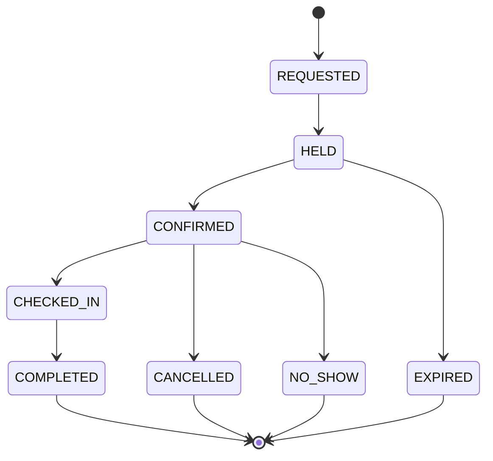
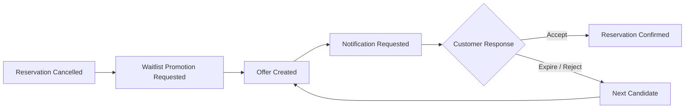
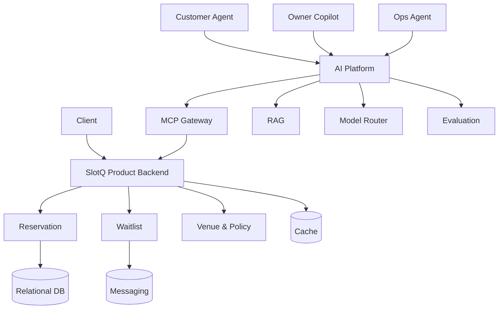
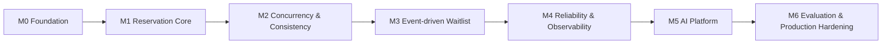

<div align="center">

# SlotQ

### Real-time Reservation & Venue Operations Platform

**동시 예약 · 이벤트 기반 대기열 · 멀티테넌트 운영 · AI Agent Platform**

**Product Backend 65% · AI Platform 35%**

</div>

---

## Overview

**SlotQ**는 매장의 예약, 수용량, 대기열, 운영 정책을 일관성 있게 처리하는 **실시간 Venue Operations Platform**입니다.

예약 CRUD를 넘어서, 실제 서버 개발에서 발생하는 **동시성, 데이터 정합성, 상태 전이, 이벤트 중복, 부분 장애와 복구**를 직접 다루는 것을 목표로 합니다.

Product Backend를 충분히 구축한 이후에는 여러 AI Agent가 SlotQ의 기능을 안전하게 사용할 수 있도록 **MCP Gateway, RAG, Model Routing, Evaluation**을 포함한 공통 AI Platform으로 확장합니다.

> **Product first.** AI 기능보다 신뢰할 수 있는 예약·대기·운영 시스템을 먼저 만듭니다.

---

## What SlotQ Solves

| Challenge | 핵심 질문 |
| --- | --- |
| **Concurrent Reservation** | 마지막 하나의 자원에 요청이 동시에 들어와도 수용량 초과를 막을 수 있는가? |
| **Reservation Lifecycle** | 예약의 상태 전이와 비즈니스 규칙을 도메인 수준에서 일관되게 보장할 수 있는가? |
| **Event-driven Waitlist** | 취소 이후 대기 고객 승급을 중복·유실에 강하게 처리할 수 있는가? |
| **Idempotency & Recovery** | 요청이나 이벤트가 재시도되어도 동일한 결과를 보장하고 장애 후 복구할 수 있는가? |
| **Multi-tenancy** | 여러 Venue의 데이터와 권한을 하나의 플랫폼에서 안전하게 격리할 수 있는가? |
| **AI Tool Execution** | AI Agent가 실제 Product API를 사용할 때 권한, 실행, 감사 로그를 어떻게 통제할 것인가? |

---

## Core Domain

```text
Tenant
└── Venue
    ├── Resource
    ├── Capacity
    ├── Slot
    ├── Reservation
    ├── Waitlist
    └── Policy
```

초기 데모는 **매장 예약**을 기준으로 구현하되, 핵심 모델은 특정 업종에 과도하게 결합하지 않는 방향을 지향합니다.

| Venue | Reservable Resource |
| --- | --- |
| Restaurant | Table / Time Slot |
| Salon | Stylist / Time Slot |
| Clinic | Doctor / Room |
| Studio | Room |
| Workshop | Seat |

---

## Reservation Invariant

SlotQ가 가장 먼저 지켜야 할 핵심 규칙입니다.

```text
confirmed reservations <= capacity
```

동일한 마지막 자원을 여러 사용자가 동시에 예약하더라도 이 invariant가 깨지지 않아야 합니다.

구현 과정에서는 특정 동시성 제어 기술을 미리 정답으로 두지 않고, 필요에 따라 다음 전략을 비교하고 측정합니다.

```text
Optimistic Lock
      vs
Pessimistic Lock
      vs
Distributed Lock
```

주요 비교 지표는 **Throughput, P50/P95/P99 Latency, Failure Rate, Lock Wait, Database Load**입니다.

---

## Reservation Lifecycle

예약은 단순 생성/삭제가 아니라 명확한 상태와 전이 규칙을 가집니다.



잘못된 상태 전이는 애플리케이션 외부가 아니라 **도메인 자체에서 차단**하는 것을 목표로 합니다.

---

## Event-driven Waitlist

예약 취소 등으로 자원이 다시 사용 가능해지면 대기 고객에게 새로운 예약 기회를 제공합니다.



이 흐름을 구현하며 다음 문제를 다룹니다.

- at-least-once delivery 환경의 **중복 이벤트 처리**
- **Idempotent Consumer**와 비즈니스 유니크 제약
- 재시도와 **Dead Letter Queue**
- DB commit과 event publish 사이의 불일치
- **Transactional Outbox** 도입 여부
- Consumer 또는 메시지 브로커 장애 이후 복구

---

## Architecture Direction

SlotQ는 처음부터 Microservices Architecture를 전제로 하지 않습니다.

**Modular Monolith**로 출발하여 도메인 경계를 명확히 만들고, 실제 운영상 분리할 이유가 생겼을 때 서비스 분리를 검토합니다.



> 위 구성요소와 기술은 **목표 아키텍처 방향**이며, 개발 과정에서 실제 필요성과 실험 결과에 따라 도입 여부를 결정합니다.

---

## AI Platform

AI는 SlotQ의 출발점이 아니라 **신뢰할 수 있는 Product Backend 위에 올라가는 두 번째 축**입니다.

하나의 챗봇을 만드는 것이 아니라 여러 AI 기능이 공통 기반을 재사용하는 구조를 목표로 합니다.

### Planned Consumers

- **Customer Agent** — 예약 가능 시간 조회, 예약·변경·취소
- **Owner Copilot** — 예약 현황 요약, 운영 정책 질의
- **Ops Agent** — 운영 정보 탐색 및 제한된 관리 작업

### Planned Platform Capabilities

| Component | Responsibility |
| --- | --- |
| **MCP Gateway** | Authentication, Authorization, Tool Registry, Rate Limit, Timeout, Audit Log |
| **RAG** | 운영 정책, 취소 정책, 메뉴·알레르기 정보, 매장 안내 등 비정형 지식 검색 |
| **Model Router** | Cost, Latency, Quality, Security 조건에 따른 모델 선택 |
| **Evaluation** | Tool Selection, Parameter Extraction, Retrieval Quality, Execution Success, Forbidden Action Detection |

실시간 예약 가능 여부처럼 지속적으로 변하는 transactional state는 RAG가 아닌 **Product API를 Source of Truth**로 사용합니다.

---

## Engineering Principles

### 1. Product First

```text
Product Backend 65%  |  AI Platform 35%
```

예약, 동시성, 정합성, 이벤트 신뢰성을 먼저 해결합니다.

### 2. Start Simple

필요성이 증명되지 않은 분산 시스템이나 인프라를 처음부터 도입하지 않습니다.

### 3. Measure Before Choosing

기술 선택은 가능한 경우 **재현 가능한 실험과 수치**를 근거로 결정합니다.

### 4. Design for Failure

Happy Path뿐 아니라 다음 상황을 설계 대상으로 봅니다.

`Duplicate Request` · `Duplicate Event` · `Timeout` · `Consumer Failure` · `Cache Failure` · `Broker Failure` · `Partial Failure`

### 5. Record Decisions

중요한 선택은 코드에만 남기지 않고 ADR, 실험 결과, 장애 기록으로 문서화합니다.

---

## Technology Direction

기술 스택은 개발 과정의 요구사항과 실험 결과에 따라 확정합니다.

| Area | Candidates |
| --- | --- |
| Backend | Java / Kotlin, Spring Boot, Spring Data JPA |
| Persistence | MySQL |
| Cache | Redis |
| Messaging | Apache Kafka |
| Observability | Prometheus, Grafana |
| Infrastructure | Docker, Kubernetes |
| AI Platform | LLM APIs / Self-hosted Models, RAG, MCP, Model Routing, Agent Evaluation |

**모든 기술을 사용하는 것이 목표가 아닙니다.** 사용하지 않는 편이 더 적절하다면 그것 또한 기술적 결정으로 기록합니다.

---

## Roadmap



| Milestone | Goal |
| --- | --- |
| **M0** | 프로젝트 기반과 핵심 도메인 경계 정의 |
| **M1** | 예약·수용량·상태 전이의 기본 모델 구현 |
| **M2** | 동시 예약과 데이터 정합성 검증 |
| **M3** | 이벤트 기반 대기열과 멱등 처리 |
| **M4** | 장애 복구, 관측 가능성, 성능 실험 |
| **M5** | MCP, RAG, Model Routing 기반 AI Platform |
| **M6** | Agent Evaluation과 Production Hardening |

세부 Milestone과 Issue는 설계 과정에서 단계적으로 구체화합니다.

---

## Engineering Records

중요한 기술적 의사결정과 실험은 다음 구조로 기록할 예정입니다.

```text
docs/
├── adr/
├── architecture/
├── experiments/
└── troubleshooting/
```

예정된 주요 기록 주제:

- 동시성 제어 방식 비교
- Reservation invariant와 상태 전이 설계
- HOLD 만료와 복구 전략
- Transactional Outbox 도입 판단
- Event delivery와 idempotency 전략
- Modular Monolith의 도메인 경계
- RAG와 Transactional API의 책임 분리
- MCP Tool 실행 권한 모델
- Model Routing 기준과 평가 방법

---

## Project Status

> **Planning**

현재 SlotQ는 초기 설계 단계입니다. 핵심 도메인과 invariant를 먼저 정의한 뒤 Milestone 단위로 구현을 진행합니다.

---

<div align="center">

**SlotQ — Build the product first. Add intelligence on top.**

</div>
