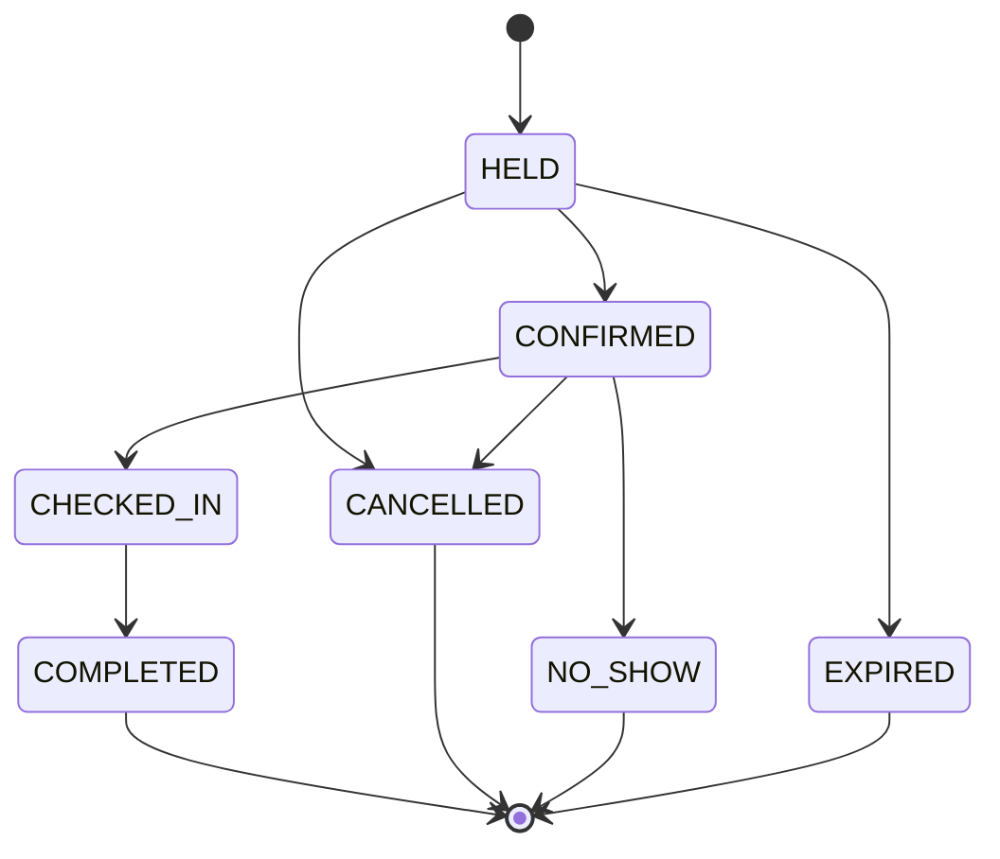
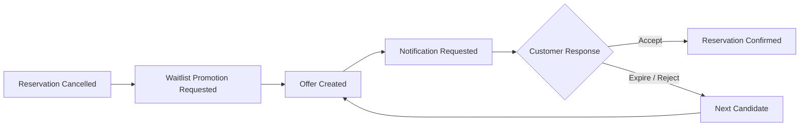
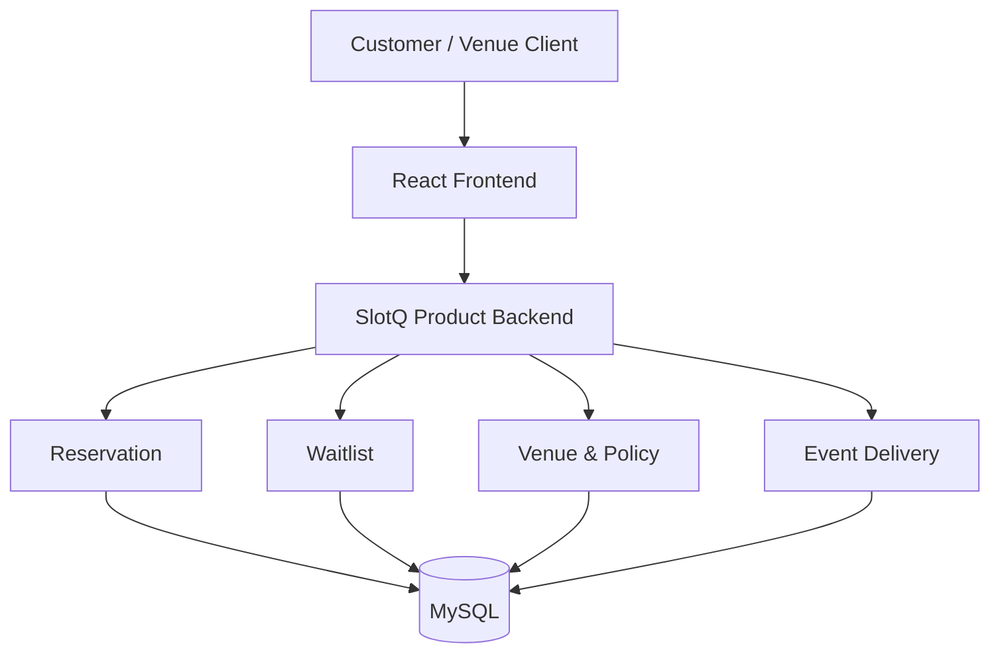

<div align="center">

# SlotQ

### 동시 예약과 대기열을 데이터 정합성·장애 복구까지 고려해 처리하는 매장 예약·운영 플랫폼

**동시 예약 · 상태 전이 · 이벤트 기반 대기열 · 멀티테넌시 · 장애 복구**

**현재 상태: M4 Waitlist Promotion 완료**

</div>

---

## 프로젝트 소개

**SlotQ**는 매장의 예약, 수용량, 대기열, 운영 정책을 일관성 있게 처리하는 예약·운영 플랫폼입니다.

예약 CRUD를 넘어 실제 서버 개발에서 마주치는 **동시성, 데이터 정합성, 상태 전이, 이벤트 중복, 부분 장애와 복구**를 직접 구현하고 검증하는 것을 목표로 합니다.

현재 Product Backend의 예약·동시성·이벤트 전달·대기열 흐름까지 구현했습니다. 이후에는 이 기반을 유지하면서 여러 AI 기능이 Product API를 안전하게 사용할 수 있도록 MCP Gateway, RAG, Model Router, Evaluation을 포함한 공통 AI Platform으로 확장할 예정입니다.

---

## 해결하려는 문제

| 영역 | 핵심 질문 |
| --- | --- |
| **동시 예약** | 마지막 하나의 자원에 요청이 동시에 들어와도 수용량 초과를 막을 수 있는가? |
| **예약 상태 전이** | 예약의 상태와 비즈니스 규칙을 도메인 수준에서 일관되게 보장할 수 있는가? |
| **이벤트 기반 대기열** | 취소 이후 대기 고객 승급을 중복·유실에 강하게 처리할 수 있는가? |
| **멱등성·복구** | 요청이나 이벤트가 재시도되어도 같은 결과를 보장하고 장애 이후 복구할 수 있는가? |
| **멀티테넌시** | 여러 Venue의 데이터와 권한을 하나의 플랫폼에서 안전하게 격리할 수 있는가? |
| **AI 도구 실행** | AI Agent가 Product API를 사용할 때 권한, 실행, 감사 기록을 어떻게 통제할 것인가? |

---

## 핵심 도메인

```text
Tenant
└── Venue
    ├── Resource
    ├── Capacity
    ├── Slot
    ├── Reservation
    ├── Waitlist
    └── Policy
```

초기 구현은 Restaurant을 기준으로 하되, 예약 핵심 모델은 특정 업종에 불필요하게 결합하지 않는 방향을 유지합니다.

자세한 도메인 모델은 [Domain Model](docs/architecture/domain-model.md)에서 확인할 수 있습니다.

---

## 핵심 설계

### 예약 불변식

SlotQ가 가장 먼저 지켜야 할 규칙은 다음과 같습니다.

```text
confirmed reservations <= capacity
```

동일한 마지막 자원을 여러 사용자가 동시에 예약하더라도 이 규칙이 깨지지 않아야 합니다.

Restaurant MVP의 최소 경합 단위는 capacity가 1인 배타적 `Table × Slot`입니다. 초기 동시성 검증은 동일 Table의 double booking 방지를 중심으로 하며, 일반화된 Capacity 모델을 사용한다는 이유만으로 pooled capacity나 대규모 처리 능력을 주장하지 않습니다.

동시성 제어 방식은 미리 정답으로 고정하지 않고 실험을 통해 비교합니다.

```text
Optimistic Lock
      vs
Pessimistic Lock
      vs
Distributed Lock
```

비교 지표는 **처리량, P50/P95/P99 지연 시간, 실패율, Lock Wait, DB 부하**입니다.

### 예약 상태 전이

예약은 생성·삭제만으로 표현하지 않고 명확한 상태와 전이 규칙을 가집니다.



허용되지 않은 상태 전이는 애플리케이션 외부가 아니라 **도메인 자체에서 차단**합니다.

MVP에서는 실제 비동기 승인 절차가 없는 `REQUESTED`를 영속 상태로 두지 않습니다. 결제나 수동 승인처럼 독립된 비즈니스 수명이 생기면 명시적인 상태 전이와 함께 다시 검토합니다.

### 이벤트 기반 대기열

예약 취소 등으로 자원이 다시 사용 가능해지면 대기 고객에게 새로운 예약 기회를 제공합니다.



이 흐름에서는 다음 문제를 검증합니다.

- at-least-once delivery에서의 중복 이벤트 처리
- Idempotent Consumer와 비즈니스 유니크 제약
- 재시도와 실패 상태 관리
- DB commit과 event 전달 사이의 불일치
- 프로세스 재시작과 DB 장애 이후 복구
- 기존 예약 수용량 불변식과 대기 승급의 결합

M3에서 선택한 이벤트 전달 구조와 M4 Waitlist 연결은 [Event Delivery](docs/architecture/event-delivery.md)와 [Waitlist Promotion](docs/architecture/waitlist-promotion.md)에 기록합니다.

---

## 현재 아키텍처

SlotQ는 처음부터 Microservices Architecture를 전제로 하지 않습니다.

현재 Product Backend는 **Modular Monolith**로 구성하며, 도메인 경계를 코드와 테스트로 분리합니다. 서비스 분리는 실제 운영상 독립 배포나 장애 격리가 필요한 근거가 생겼을 때 검토합니다.



현재 이벤트 전달의 기준선은 **Transactional event record + DB 전달**입니다. Booking transaction과 이벤트 기록의 원자성을 보존하고, 재시도·중복·프로세스 재시작·DB 장애 복구를 검증했습니다.

중요한 아키텍처 결정은 [ADR Register](docs/adr/README.md), 세부 구조는 [Architecture 문서](docs/architecture/)에서 관리합니다.

---

## 향후 확장: AI Platform

AI Platform은 현재 Product Backend 위에 추가할 후속 범위입니다. 하나의 챗봇을 만드는 것이 아니라 여러 AI 기능이 공통 기반을 재사용하도록 설계할 예정입니다.

예정된 AI 기능:

- **Customer Agent** — 예약 가능 시간 조회, 예약·변경·취소
- **Owner Copilot** — 예약 현황 요약, 운영 정책 질의
- **Ops Agent** — 운영 정보 탐색과 제한된 관리 작업

예정된 플랫폼 기능:

| 구성 요소 | 역할 |
| --- | --- |
| **MCP Gateway** | Authentication, Authorization, Tool Registry, Rate Limit, Timeout, Audit Log |
| **RAG** | 운영 정책, 취소 정책, 메뉴·알레르기 정보, 매장 안내 등 비정형 지식 검색 |
| **Model Router** | Cost, Latency, Quality, Security 조건에 따른 모델 선택 |
| **Evaluation** | Tool Selection, Parameter Extraction, Retrieval Quality, Execution Success, Forbidden Action Detection |

실시간 예약 가능 여부처럼 계속 변하는 transactional state는 RAG가 아니라 **Product API를 기준 데이터(Source of Truth)** 로 사용합니다.

세부 범위와 착수 조건은 [Roadmap](docs/roadmap.md)에서 관리합니다.

---

## 설계 원칙

- **Product 우선** — AI 기능보다 예약·동시성·정합성·이벤트 신뢰성을 먼저 검증합니다.
- **필요성 검증 후 도입** — 분산 시스템이나 인프라는 해결할 문제가 확인된 뒤 비교합니다.
- **측정 기반 선택** — 가능한 경우 재현 가능한 실험과 수치를 기술 선택의 근거로 남깁니다.
- **실패 경로 포함** — 중복 요청, 중복 이벤트, timeout, process/DB failure, partial failure를 설계 대상으로 봅니다.
- **결정 기록** — 중요한 선택은 코드에만 남기지 않고 ADR, 실험 결과, 복구 기록으로 문서화합니다.

---

## 기술 구성과 선택

| 영역 | 현재 기준 | 상태 |
| --- | --- | --- |
| 백엔드 | Java 25 LTS, Spring Boot, Spring MVC, Spring Data JPA | **채택** |
| 프론트엔드 | React, TypeScript, Vite 기반 SPA | **채택** |
| 빌드 | Gradle Wrapper | **채택** |
| 데이터베이스 | MySQL 8.4 LTS, Flyway | **채택** |
| 테스트 | JUnit, Testcontainers MySQL | **채택** |
| 캐시 | Redis | 필요성과 측정 결과가 생길 때 검토 |
| 이벤트 전달 | Transactional event record + DB 전달 | ADR-0007과 M3 구현으로 채택, M4 실제 Booking→Waitlist 흐름 검증 완료 |
| 관측 | Spring Boot Actuator, Micrometer부터 시작 | M5에서 구체화 |
| 인프라 | 로컬 container 환경부터 시작 | Kubernetes는 운영상 필요가 생길 때 검토 |
| AI Platform | MCP, RAG, Model Router, Agent Runtime, Evaluation | M6 이후 단계적 도입 |

Java, Gradle Wrapper, Modular Monolith, React·TypeScript·Vite 등 주요 선택 근거는 [ADR Register](docs/adr/README.md)에 기록합니다.

모든 후보 기술을 사용하는 것을 목표로 하지 않습니다. 사용하지 않는 편이 적절하다는 결론도 실험과 근거가 있다면 기술적 결정으로 기록합니다.

### 저장소 구조

```text
slotq/
├── backend/     Spring Boot Product Backend
├── frontend/    React·TypeScript·Vite SPA
├── infra/       로컬·운영 인프라 설정
├── docs/        Architecture, ADR, Roadmap, 실험 기록
└── .github/     Issue, PR, CI 정책
```

세부 경계와 schema migration 소유권은 [Repository Layout](docs/architecture/repository-layout.md)에 기록합니다.

### Backend 검증

로컬 build에는 Gradle이 탐지할 수 있는 JDK 25가 필요합니다. CI는 Temurin JDK 25를 사용합니다.

```bash
cd backend
./gradlew test
./gradlew clean build
```

Windows PowerShell에서는 `./gradlew` 대신 `.\gradlew.bat`를 사용합니다.

---

## Roadmap

```mermaid
flowchart LR
    M0[M0 Foundation] --> M1[M1 Reservation Core]
    M1 --> M2[M2 Concurrency & Consistency]
    M2 --> M3[M3 Reliable Event Foundation]
    M3 --> M4[M4 Waitlist Promotion]
    M4 --> M5[M5 Reliability & Observability]
    M5 --> M6[M6 AI Access & Knowledge]
    M6 --> M7[M7 Model Router & Agent Runtime]
    M7 --> M8[M8 Evaluation & Production Hardening]
```



- **M0~M4:** 완료
- **M5:** Reliability & Observability
- **M6~M8:** AI Access & Knowledge → Model Router & Agent Runtime → Evaluation & Production Hardening

M0부터 M5까지 Product Backend와 운영 신뢰성을 먼저 완성하고, M6 이후 AI Platform 범위로 이동합니다.

Milestone별 완료 조건, 현재 상태, Issue 의존 관계는 [Roadmap](docs/roadmap.md)에서 관리합니다.

---

## 설계·실험 기록

중요한 기술적 의사결정과 실험은 README에 모두 복제하지 않고 아래 문서에서 관리합니다.

- [Product Scope](docs/product-scope.md)
- [Domain Model](docs/architecture/domain-model.md)
- [Roadmap](docs/roadmap.md)
- [ADR Register](docs/adr/README.md)
- [Experiment Plans](docs/experiments/README.md)

현재까지의 주요 기록에는 동시성 제어 비교, HOLD 만료와 복구, 이벤트 전달과 멱등성, 프로세스·DB 장애 복구, Waitlist 승급과 브라우저 복구가 포함됩니다.

---

## 현재 상태

> **M4 Waitlist Promotion — Complete**

M0 Foundation부터 M3 Reliable Event Foundation까지의 선행 Milestone은 완료 상태를 유지합니다.

M4에서는 M3에서 구축한 이벤트 전달 기반을 실제 **Booking → Waitlist** 흐름에 연결했습니다. 대기 등록·취소, Promotional HOLD 기반 Offer, 두 가지 승급 경로, 재시작·DB 장애 복구, Customer/Venue UI까지 구현하고 검증했습니다.

종료 감사에서 발견된 브라우저 비동기 상태 문제도 보정했으며 Backend CI, Frontend CI, PR Policy 통과 후 M4를 완료로 확정했습니다.

자세한 완료 근거와 Issue 의존 관계는 [Roadmap](docs/roadmap.md), Waitlist 관련 설계와 복구 증거는 [Architecture 문서](docs/architecture/)에서 확인할 수 있습니다.
