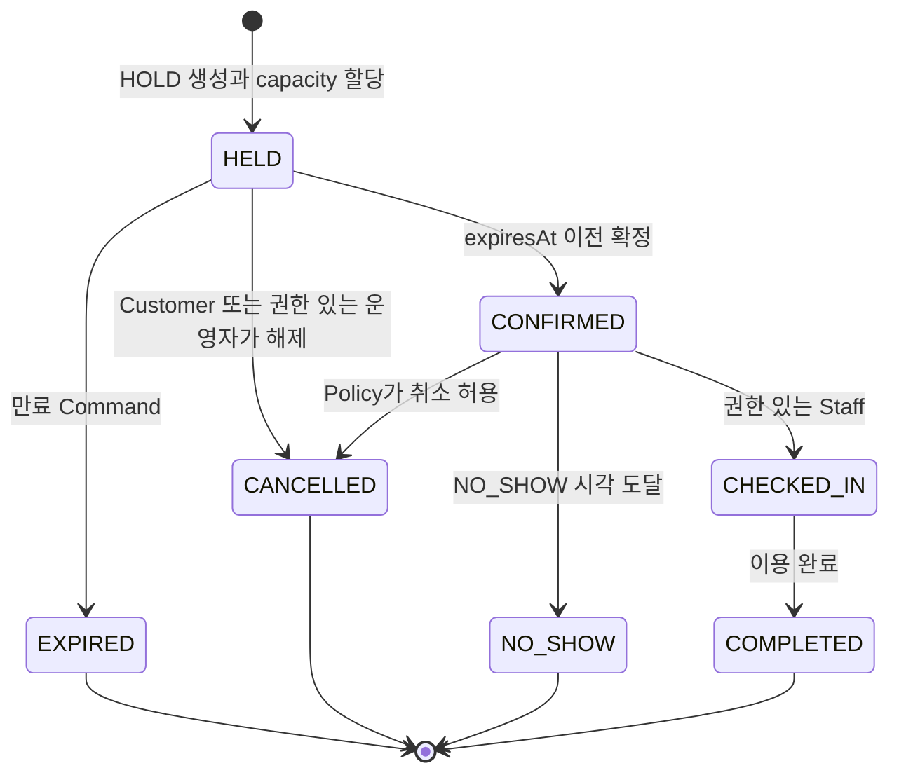
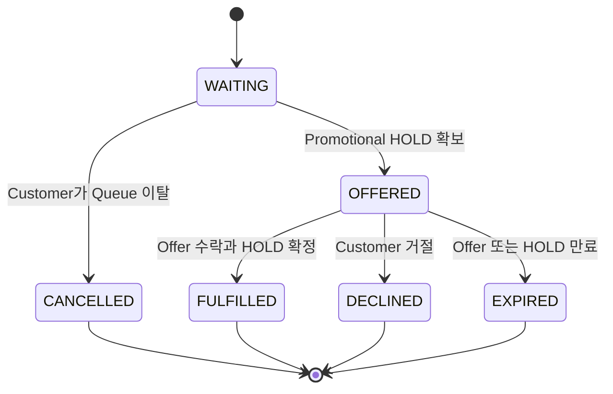

# SlotQ Domain Model

> 상태: Proposed
>
> 관련 범위: [SlotQ 제품 범위](../product-scope.md)
>
> Product Charter: [README](../../README.md)

## 1. Modeling 원칙

- Domain Model은 Infrastructure 최적화보다 Reservation 정합성을 먼저 보호한다.
- Product Charter의 계층은 제품 소유 관계와 용어를 보여 주며, 한 번에 적재하거나
  갱신할 하나의 Aggregate Graph를 의미하지 않는다.
- Aggregate 경계는 실제 정합성과 Lifecycle 요구를 따른다. 요구사항의 모든 명사를
  Aggregate로 만들지 않는다.
- `Slot`, `Capacity`, `Policy`는 독립 Service가 아닌 Value 개념으로 시작한다.
- Availability는 Inventory와 Allocation 상태에서 만드는 Query Model이다.
- 초기에는 여러 Module이 하나의 MySQL Database를 사용할 수 있지만 변경 가능한 JPA
  Entity를 공유하지 않는다. Module 간 참조는 Typed ID, Application Port, Event를
  사용한다.
- Tenant 소유 Aggregate는 모두 `TenantId`를 가지며, 개별 ID가 존재하더라도
  Cross-tenant 참조는 유효하지 않다.

## 2. Bounded Context

### 2.1 Access and Tenancy

인증된 Principal을 허용된 Tenant, Venue, Role, Action Scope에 연결한다. 범용 Identity
Provider 자체를 구현할 필요는 없다.

Aggregate Root:

- `Tenant`
- `TenantMembership`

### 2.2 Venue Configuration

Venue Identity, Timezone, 활성 Resource, 영업시간과 구조화된 예약 Policy를 소유한다.
Venue가 Policy를 수정해도 기존 Reservation의 동작이 암묵적으로 바뀌지 않도록 Booking은
적용한 Policy Version 또는 계산된 Deadline을 저장한다.

Aggregate Root:

- `Venue`
- `Resource`

`Resource`는 계속 커지는 `Venue`의 하위 Collection이 아니라 별도 Root다. Inventory와
Reservation이 직접 참조하고 Lifecycle도 독립적으로 변경되기 때문이다.

### 2.3 Booking

Availability, Capacity Allocation, Reservation HOLD, 확정, 취소와 운영 Lifecycle을
소유한다. 초기 Architecture에서는 Allocation의 생성·해제와 Reservation 상태 변경이
강한 Local Transaction을 공유해야 하므로 Inventory와 Reservation을 서로 다른 Bounded
Context로 나누지 않는다.

Aggregate Root:

- `SlotInventory`
- `Reservation`

Availability는 Aggregate가 아니다. 적합한 Resource, SlotInventory, 활성 Allocation,
Venue Policy에서 만드는 Read Model이다.

### 2.4 Waitlist

수요 등록, 결정적인 적합 후보 순서, 승급 시도와 Offer Lifecycle을 소유한다. Reservation
capacity는 소유하지 않는다. 실행 가능한 Offer를 노출하기 전에 Booking을 통해 실제
promotional HOLD를 확보해야 한다.

Aggregate Root:

- `WaitlistEntry`
- `WaitlistOffer`

Queue 전체를 하나의 거대한 Aggregate로 만들지 않는다. Venue-Slot Queue는 유용한
상한 없이 커질 수 있고, 모든 등록·취소·승급을 하나의 Object로 직렬화하면 Hot Lock이
생긴다. 순서 결정과 Claim은 Database Constraint와 멱등 Command로 보호하는
Repository/Application Process의 책임이다.

### 2.5 Supporting Module

Notification Delivery, Audit Recording, Observability는 Downstream Port와 Adapter로
시작한다. 독립 Lifecycle, Data Model 또는 Deployment 요구가 실제로 생길 때만 별도
Bounded Context로 승격한다.

AI Platform은 Product Backend의 Upstream Dependency가 아니라 미래의 Product API
Consumer다.

## 3. Context 의존 방향

다음 화살표는 `Consumer -> Provider`를 뜻한다.

```text
Venue Configuration -> Access and Tenancy
Booking             -> Access and Tenancy
Booking             -> Venue Configuration
Waitlist            -> Booking Public Command와 Event
Notification        -> Booking과 Waitlist Event
Audit/Observability -> 공개된 Application Event와 Metadata
AI Platform         -> 인증된 Product API
```

Booking은 Waitlist Type을 참조하지 않고 capacity 반환 사실만 발행한다. Waitlist는 이
공개 Contract를 소비하고 Booking의 `CreatePromotionalHold` 같은 Command를 호출한다.
이 방향은 Booking을 선택적인 승급 흐름에서 독립시키고 Module 순환 의존을 방지한다.

## 4. Aggregate 후보

| Bounded Context | Aggregate Root | 주요 책임 | 중요한 경계 |
| --- | --- | --- | --- |
| Access and Tenancy | `Tenant` | Tenant Lifecycle과 상태 | 모든 Venue나 Member를 메모리 Collection으로 포함하지 않는다. |
| Access and Tenancy | `TenantMembership` | 한 Tenant 안의 Principal Role과 Venue Grant | 독립적으로 조회하고 철회할 수 있다. |
| Venue Configuration | `Venue` | Venue Identity, Timezone, 영업시간, Policy Version | 실시간 Reservation 상태를 소유하지 않는다. |
| Venue Configuration | `Resource` | 예약 가능한 Resource Identity, 활성 상태, Capability | 정확히 하나의 Tenant와 Venue에 속한다. |
| Booking | `SlotInventory` | 한 Resource Slot의 Capacity Limit, 활성 Allocation과 동시성 경계 | 동시 Transaction에서도 capacity invariant를 지켜야 한다. |
| Booking | `Reservation` | Customer 의도, 적용된 Policy Deadline과 Lifecycle 전이 | Waitlist 상태를 직접 변경하지 않는다. |
| Waitlist | `WaitlistEntry` | 한 Customer의 수요와 Queue Lifecycle | Customer와 DemandKey별 활성 Entry는 최대 하나다. |
| Waitlist | `WaitlistOffer` | Promotional HOLD가 뒷받침하는 기한 있는 Offer | Entry별 활성 Offer는 최대 하나고 수락은 멱등이다. |

이 경계는 Schema와 동시성 테스트로 검증할 후보이다. Persistence 편의만으로 Root를
합치거나 Aggregate를 추가하지 않는다.

## 5. Entity와 Value Object

### 5.1 Entity

`CapacityAllocation`은 `SlotInventory` 정합성 경계 안의 Entity다. 자체 Identity를
가지고 하나의 Reservation을 참조하며 Allocation Unit이 활성인지 해제되었는지
기록한다. 물리 구현은 Allocation Row, Atomic Counter 또는 둘의 조합일 수 있다.
동시성 실험으로 Mechanism을 선택하되 Domain invariant는 바꾸지 않는다.

`TenantMembership`, `Resource`, `Reservation`, `WaitlistEntry`, `WaitlistOffer`도
독립적으로 Lifecycle을 다루므로 Entity이자 Aggregate Root다.

Idempotency Record, Processed Event Marker, Outbox Record는 새로운 Business
Aggregate가 아니라 Application Reliability State다.

### 5.2 Value Object

초기 Value Object 후보:

- `TenantId`, `VenueId`, `ResourceId`, `SlotInventoryId`, `ReservationId`
- `WaitlistEntryId`, `WaitlistOfferId`, `PrincipalId`
- `TimeWindow`, 고정 길이 `Slot`
- `Capacity`, `AllocationQuantity`
- `PartySize`
- `HoldExpiry`, `OfferExpiry`
- `DemandKey`, 결정적인 `QueuePositionKey`
- `BookingPolicySnapshot` 또는 계산된 Policy Deadline
- `IdempotencyKey`, Request Fingerprint
- `CustomerReference`, 최소화된 Contact Value
- Cancellation, Expiry, Transition Reason

`Policy`는 Venue가 소유한 Version이 있는 구조화 Value로 시작한다. 독립 Lifecycle,
승인 또는 이력 요구가 생길 때만 별도 Aggregate로 승격한다.

## 6. 핵심 invariant

### 6.1 Capacity invariant

Product Charter의 최소 규칙은 다음과 같다.

```text
confirmed reservations <= capacity
```

이 규칙만으로는 확정 전 capacity를 예약하는 HOLD를 보호할 수 없다. 더 강한 invariant는
다음과 같다.

```text
각 SlotInventory에 대해:
    sum(active CapacityAllocation.units) <= SlotInventory.capacity
```

`HELD`, `CONFIRMED`, `CHECKED_IN` Reservation의 Allocation은 활성 상태다.
`EXPIRED`, `CANCELLED`, `NO_SHOW`, `COMPLETED` Reservation의 Allocation은 활성 상태가
아니다. Product Charter의 규칙은 이 강한 invariant의 결과로 보장된다.

Restaurant MVP에서 하나의 Table과 고정 Slot 조합은 capacity `1`을 가지며, 인원수는
별도 적합성 규칙으로 검사한다.

```text
partySize <= Resource.seatingCapacity
```

### 6.2 Tenant와 참조 invariant

- Reservation, Resource, SlotInventory, Allocation, WaitlistEntry, WaitlistOffer는
  같은 `TenantId`와 호환되는 `VenueId`를 가져야 한다.
- Resource는 하나의 Venue에 속하며 비활성 상태에서는 새로 예약할 수 없다.
- Server는 인증된 Principal과 저장된 소유 관계에서 Tenant Scope를 결정한다. Request
  Field만으로 Scope를 넓힐 수 없다.
- 한 Reservation에는 활성 CapacityAllocation이 최대 하나만 존재한다.

### 6.3 Reservation invariant

- HOLD는 변경할 수 없는 서버 기준 `expiresAt` 이전에만 확정할 수 있다.
- 하나의 Business Change를 구성하는 상태 전이, Allocation 활성화·해제, 내구성 있는
  Event 기록은 원자적으로 처리한다.
- Terminal State는 일반 Customer 또는 Staff Command로 다시 전이하지 않는다.
- Venue Policy가 바뀌어도 기존 Reservation의 적용 Deadline은 암묵적으로 바뀌지 않는다.
- 같은 Idempotency Scope, Key, Request Fingerprint의 반복 Command는 최초 결과를
  반환하며, 다른 Fingerprint는 거부한다.

### 6.4 Waitlist와 Event invariant

- Customer는 같은 `DemandKey`에 활성 Entry를 최대 하나만 가진다.
- 순서는 반환된 Resource에 적합한 Entry 사이에서 `(joinedAt, id)` FIFO를 따른다.
  적합하지 않은 앞선 Entry가 모든 후속 적합 Entry를 막지는 않는다.
- 실행 가능한 Offer는 항상 유효한 Promotional HOLD를 참조한다.
- Entry별 활성 Offer는 최대 하나이며, 하나의 Offer는 최대 하나의 Reservation만
  확정할 수 있다.
- Transport가 Event를 한 번 이상 전달하더라도 각 Consumer는 안정적인 Event ID를
  최대 한 번 적용한다.

## 7. Reservation Lifecycle

### 7.1 MVP 영속 상태



| 전이 | 필수 Guard | capacity 영향 |
| --- | --- | --- |
| 생성 -> `HELD` | Resource와 Slot이 적합하고 capacity를 할당할 수 있다. | Allocation 활성화 |
| `HELD -> CONFIRMED` | 현재 서버 시각이 `expiresAt` 이전이다. | Allocation 활성 유지 |
| `HELD -> EXPIRED` | 만료 시각이 지났다. | Allocation 멱등 해제 |
| `HELD -> CANCELLED` | 호출자가 HOLD 소유자이거나 허용된 Venue Role을 가진다. | Allocation 즉시 해제 |
| `CONFIRMED -> CANCELLED` | 호출자 권한과 취소 Policy가 허용한다. | Allocation 해제 |
| `CONFIRMED -> CHECKED_IN` | Staff가 Venue에 할당되었고 Check-in 시각이 유효하다. | Allocation 활성 유지 |
| `CONFIRMED -> NO_SHOW` | NO_SHOW 기준 시각이 지났다. | Allocation 해제 |
| `CHECKED_IN -> COMPLETED` | 권한 있는 운영 Command다. | 활성 Allocation 종료, 이력 보존 |

`HELD -> CANCELLED`는 Target Lifecycle에 의도적으로 추가한다. Customer 또는 운영자가
불필요한 HOLD를 즉시 해제할 수 있어야 한다. 만료까지 기다리게 하면 사용자 의도를
숨기고 Availability와 Waitlist 승급을 불필요하게 지연시킨다. Transition Reason과
Actor Metadata로 명시적 취소와 자동 만료를 구분한다.

### 7.2 `REQUESTED` 처리

`REQUESTED`는 수동 승인이나 결제 승인처럼 접수된 Command가 실제 비동기 선행 조건을
기다려야 하는 미래 흐름을 위한 Target State로 남긴다. MVP에는 그런 선행 조건이 없다.
지금 `REQUESTED`를 영속화하면 Owner, Timeout, Recovery 의미가 없는 인위적인 상태가
된다.

따라서 MVP의 생성 Command는 capacity와 함께 `HELD`를 원자적으로 만들거나 실패한다.
`REQUESTED`를 영속화하지 않는다. 실제 비동기 승인 이유가 생기면 ADR에서 Owner,
Timeout, Failure, Retry와 전이를 정의한 후 `REQUESTED -> HELD`를 추가한다.

### 7.3 잘못된 전이

Controller와 Worker는 Status Field를 직접 설정하지 않고 의도가 드러나는 Domain
Command를 호출한다. 만료된 HOLD 확정, 취소된 Reservation의 CHECKED_IN, CHECKED_IN
없는 COMPLETED, 다른 Payload로 Terminal 전이를 재실행하는 요청은 일관되게 거부한다.

예외적 정정은 Terminal State를 일반 Update API로 다시 여는 대신 별도 권한, 사유,
Audit를 요구하는 Command로 다룬다.

## 8. Waitlist와 Offer Lifecycle



승급 Application Process의 개념적 순서:

1. 내구성 있는 Capacity Released Event를 관찰한다.
2. 다음 적합한 WAITING Entry를 결정적으로 Claim한다.
3. 안정적인 Idempotency 식별자로 Booking에 Promotional HOLD 생성을 요청한다.
4. HOLD가 존재한 후에만 Offer를 생성하거나 활성화한다.
5. Adapter를 통해 알림을 요청한다.
6. 거절 또는 만료 시 HOLD를 해제하고 다음 반환·승급 Cycle을 허용한다.

Transport 재전달은 어느 단계든 반복할 수 있다. Database Uniqueness와 멱등 Command가
반복을 안전하게 만들어야 한다. Notification 성공은 Reservation 상태 변경의 증거가
아니다.

## 9. 의도적으로 열어 둔 결정

Domain 의미는 구현 전에 안정되어야 하지만 다음 Mechanism은 Milestone 실험이나 장애
테스트의 근거가 생길 때까지 Proposed로 둔다.

- Optimistic Lock과 Pessimistic Lock
- Allocation Row와 Atomic Counter의 물리 저장 방식
- HOLD와 Offer 만료를 위한 정기 Database Polling과 Lazy Check
- Transactional Outbox와 Event Relay
- 외부 Broker 또는 Distributed Cache 필요성
- Pooled Capacity, 가변 시간 구간, 복수 Resource Allocation

어떤 Mechanism도 Capacity, Tenant, Idempotency, Lifecycle invariant를 약화해서는 안
된다.
