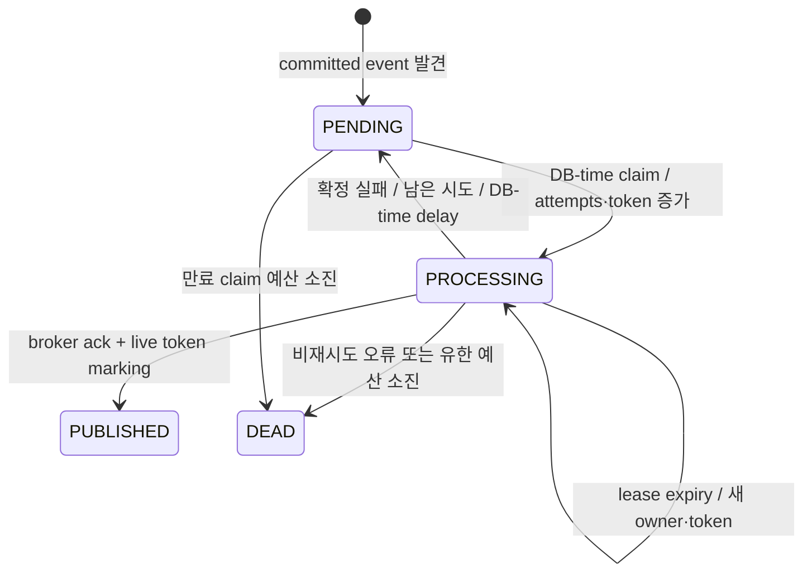

# M5 Kafka publication foundation (#107)

이 문서는 [#107](https://github.com/krestar/slotq/issues/107)의 opt-in relay 경계다.
기본 Product deployment는 [ADR-0007](../adr/0007-use-transactional-event-record-and-db-delivery.md)의
DB direct 전달을 유지한다. Kafka를 기본 transport로 채택하는 결정은 #111의 비교 evidence 이후다.

## 원본, identity, transaction

```text
Product transaction: business state + event_records append → commit
relay transaction:   event_kafka_discovery + event_kafka_publications materialize → commit
relay transaction:   PENDING/expired PROCESSING → leased PROCESSING, token+1 → commit
broker I/O:           original event → Kafka ack (no Product/MySQL transaction open)
relay transaction:   same token and live lease → PUBLISHED + ack metadata → commit
```

MySQL `event_records`의 canonical immutable event가 recovery source다. `event_kafka_publications`의
PK는 `(tenant_id,event_id,destination)`이며 logical consumer group, registration generation,
broker offset을 포함하지 않는다. DB `event_deliveries`의 `(original event, original registration)`
target과 Waitlist의 `(tenant,logical consumer,original event)` effect receipt는 각각 별도 identity다.
Kafka producer idempotence는 **한 producer session의 broker retry**에만 기여한다. ack 유실이나
broker ack 후 MySQL marking 전 종료는 동일 logical publication의 물리 record 중복을 만든다.
MySQL과 Kafka 사이 XA/2PC 또는 business exactly-once를 주장하지 않는다.

`event_kafka_discovery`는 `event_discovery`와 독립된 cursor다. `event_boundary`의 commit fence가
보장하는 sequence 순서로 committed event를 batch scan하고 두 승인된 v1 route의
`waitlist.promotion` original registration interval membership이 있는 event만 publication row로 만든다. 최초 실행 시
destination을 durable하게 묶고 설정 변경을 거부한다. publication discovery는 DB target을 만들거나
DB delivery cursor를 이동하지 않는다. Product append나 registration transaction은 Kafka를 호출하지 않는다.

## Schema와 상태

[V16 migration](../../backend/src/main/resources/db/migration/V16__create_kafka_publication_and_transport_assignment.sql)은
`event_transport_assignments`, `event_kafka_discovery`, `event_kafka_topic_state`,
`event_kafka_publications`를 추가한다. 기존 registration은 DB_DIRECT/epoch 1로 backfill하고
새 registration도 같은 transaction에서 assignment를 만든다. 자동 event, delivery, receipt,
replay, publication cleanup은 없다.



Claim은 `cycle_attempts`와 `lifetime_attempts`를 증가시키고 `lease_until`을 MySQL UTC로 저장한다.
broker I/O는 claim commit 후 실행한다. marking과 failure는 live lease 및 fencing token을 검증한다.
stale owner의 0-row update는 성공이 아니다. transient timeout/connection은 유한 delay로 재시도하고,
authorization/serialization은 stable `AUTHORIZATION`/`SERIALIZATION` DEAD다. `TIMEOUT`,
`CONNECTION`, `OTHER`, `CRASH_EXHAUSTED`도 제한된 코드이며 exception 원문을 DB에 보존하지 않는다.
publication DEAD의 human recovery는 #110이 소유한다.

## Route와 wire

| Event type | Version | Aggregate | Partition key |
| --- | ---: | --- | --- |
| `booking.capacity-released` | 1 | Reservation | `tenantId:slotInventoryId` |
| `waitlist.promotion-requested` | 1 | SlotInventory | `tenantId:slotInventoryId` |

M4 integration adapter가 exact payload field, canonical UUID, release transition과 aggregate 관계를
검증한다. wire JSON은 original event/tenant/aggregate/type/version, canonical payload,
`occurredAt`, `boundarySequence`, `recordedAt`을 담는다. 허용된 request/trace origin은 nullable이며
immutable payload와 identity 바깥에 둔다. 별도 broker header는 쓰지 않는다. UTF-8 envelope는
1 MiB 이하이고 producer의 `max.request.size`도 1 MiB다. Kafka partition ordering은 publication
순서일 뿐 Waitlist FIFO 또는 effect 완료 순서가 아니다.

`WaitlistKafkaMessage`가 승인된 consumer/route, Product 측 활성 설정과 wire mapping을 소유한다.
events foundation의 `KafkaPublicationFamily`는 이 값과 mapping을 받는 좁은 port이고,
`KafkaPublicationLedger`는 relay가 사용하는 durable publication 연산의 port다. JDBC 구현은
integration에서 받은 route만으로 discovery를 제한한다. events foundation은 M4 concrete 타입이나
route 문자열을 참조하지 않는다.

## Durable execution authority와 startup

| Role/configuration | Product append | DB target/executor | Kafka relay | Kafka intake |
| --- | --- | --- | --- | --- |
| `product`, DB_DIRECT epoch 1, M4 enabled | 기존 MANDATORY append | 허용 | 금지 | 없음 |
| `relay`, exact durable M4 routes, web=none | 금지 | 금지 | 허용 | 없음 |
| `business-enabled=true` 또는 KAFKA assignment | readiness 거부 | authority 거부 | 단독으로 activation 불가 | #108 소유 |

`slotq.events.runtime-role=relay`, `slotq.events.kafka.relay-enabled=true`,
`spring.main.web-application-type=none`, M4 promotion/maintenance/DB scheduler disabled가 relay 조건이다.
`HoldIdempotencyCleanup`도 product role에서만 등록하여 relay의 Product maintenance 실행을 막는다.
relay는 두 exact Waitlist registration과 DB_DIRECT/epoch 1을 요구한다. 같은 event type의 다른
logical consumer 등록은 Waitlist bootstrap을 막지 않는다. Product startup은 활성 Waitlist
assignment의 누락/KAFKA/epoch 불일치를 거부한다. DB direct discovery, candidate, locking effect는
DB_DIRECT/epoch 1을 확인하고 assignment row와 함께 lock한다. #107에는 assignment 변경 API가 없다.
#108이 quiesce, target inventory, fenced epoch 변경과 durable intake/offset handoff를 구현하기 전
Kafka mode business activation은 닫혀 있다. broker 중단은 기존 DB mode business append를
rollback시키지 않는다.

## Broker, retention, 보안, 관측

Spring Boot 4.1.1 BOM의 Spring Kafka 4.1.1과 Kafka client 4.2.1을 Java 25에서 실행했다.
producer는 `acks=all`, idempotence on, request timeout 5s, delivery timeout 15s,
application ack timeout 기본 20s, lease 기본 30s다. 실제 broker는
`apache/kafka:4.1.1@sha256:0bc1bb2478f45b6cea78864df86acdc11e8df2c5172477819a4d12942cbe5d40`이다.
local 3-node KRaft profile은 RF=3/min ISR=2/unclean election off, retention 24h이고
모든 노드가 한 Docker host의 공통 failure domain에 있다. 단일 broker Testcontainers는 개발
검증용이며 HA 근거가 아니다.

`KafkaRetentionProbe`는 실제 topic ID를 durable하게 묶고 partition log-start를 이미 ack된
publication offset 중 가장 오래된 위치와 대조한다. topic 재생성 또는 intake 전 gap은 relay를
fail closed한다. #108의 durable intake/committed position이 아직 없으므로 모든 PUBLISHED record를
잠재적 필요 record로 보수적으로 취급한다. 소비자 offset expiry, 안전한 recovery inventory와
handoff는 #108/#110에 남긴다. silent `latest` reset은 쓰지 않는다.

local anonymous plaintext는 loopback에만 bind한다. 비-local relay는 `SASL_SSL`과 외부에서
주입한 JAAS/truststore가 없으면 startup 실패한다. [secure profile](../../infra/kafka/compose.secure.yml)은
일회성 TLS 인증서/자격 증명을 repository 밖에 생성하고 StandardAuthorizer default deny로
relay topic WRITE/DESCRIBE, Waitlist topic+group READ, monitor DESCRIBE를 분리한다.
private key, password, JAAS 파일은 commit하지 않는다.

[#106 metrics](product-observability-metrics.md)의 publication ack/retry/failure,
pending/oldest inventory, relay/producer runtime state를 실제 signal로 연결한다.
label은 fixed transport/role/outcome/failure code만 사용하고 ID, tenant, payload, broker URL은
metric label로 쓰지 않는다. original origin은 제한된 publication attempt trace link와 wire의
nullable metadata로 전달한다. 발행되지 않은 intake/lag metric은 계속 absent다.

검증 명령, fault별 raw DB/broker snapshot과 한계는
[Kafka relay evidence](../experiments/kafka-relay/2026-09-28/README.md)에 있다.
PR #116 blocker 수정 후 재검증은
[current-run evidence](../experiments/kafka-relay/2026-09-28-blocker-regression/README.md)에 있다.
